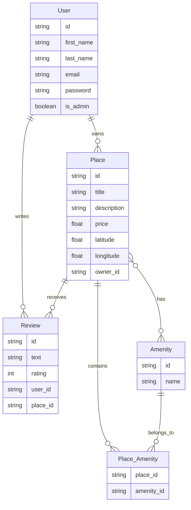

# HBnB Project 🏠

A full-stack application for vacation rental management, similar to AirBnB, built with modern web development technologies.

## 📋 Project Overview

This project is a comprehensive vacation rental platform implemented in multiple parts:

1. **Backend Business Logic & API**: Core structure with Python and Flask including models and RESTful endpoints
2. **Backend Authentication & Database**: Extended backend with JWT authentication and database integration
3. **Frontend Web Client**: Interactive web interface using HTML5, CSS3, and JavaScript ES6

## 🚀 Features

- **User Management**: Registration, authentication, and profile management
- **Place Listings**: Create, view, and manage rental property listings
- **Reviews System**: Leave and view reviews for properties
- **Amenities Management**: Track and filter properties by available amenities
- **Responsive Design**: Optimized for various device sizes
- **Secure Authentication**: JWT-based security with role-based access control
- **Persistent Storage**: Database integration with SQLAlchemy

## 💻 Technology Stack

### Backend
- **Python** with **Flask** framework
- **Flask-RESTX** for API documentation
- **SQLAlchemy** ORM for database interactions
- **JWT** for authentication
- **SQLite** for development and **MySQL** for production

### Frontend
- **HTML5**, **CSS3**, and **JavaScript ES6**
- **Fetch API** for backend communication
- **Cookie-based** session management

## 🏗️ Architecture

The application follows a layered architecture:

- **Presentation Layer**: API endpoints and web interface
- **Business Logic Layer**: Core entities and business rules
- **Data Access Layer**: Database repositories and ORM mappings

### Database Schema



## 📂 Project Structure

```plaintext
hbnb/
├── app/
│   ├── __init__.py
│   ├── api/
│   │   ├── __init__.py
│   │   ├── v1/
│   │       ├── __init__.py
│   │       ├── users.py
│   │       ├── places.py
│   │       ├── reviews.py
│   │       ├── amenities.py
│   ├── models/
│   │   ├── __init__.py
│   │   ├── user.py
│   │   ├── place.py
│   │   ├── review.py
│   │   ├── amenity.py
│   ├── services/
│   │   ├── __init__.py
│   │   ├── facade.py
│   ├── persistence/
│       ├── __init__.py
│       ├── repository.py
├── frontend/
│   ├── index.html
│   ├── login.html
│   ├── place-details.html
│   ├── assets/
│   │   ├── css/
│   │   ├── js/
│   │   ├── images/
├── run.py
├── config.py
├── requirements.txt
├── README.md
```

## 🔐 Authentication & Authorization

- JWT-based authentication using Flask-JWT-Extended
- Password hashing with bcrypt2
- Role-based access control with admin privileges
- Protected routes for authenticated users only

## 📱 Frontend Features

- **User Authentication**: Secure login using JWT token
- **Places Listing**: Dynamic display with client-side filtering
- **Place Details**: Information display and review options
- **Review Submission**: Form for authenticated users
- **Responsive Design**: Optimized for all device sizes

## 🛠️ Installation and Setup

1. Clone the repository:
   ```
   git clone https://github.com/ahmedguindou/holbertonschool-hbnb
   cd holbertonschool-hbnb
   ```

2. Install backend dependencies:
   ```
   pip install -r requirements.txt
   ```

3. Configure the database:
   ```
   flask db init
   flask db migrate
   flask db upgrade
   ```

4. Run the application:
   ```
   flask run
   ```

5. Access the frontend:
   ```
   Open frontend/index.html in your browser
   ```

## 🧪 Testing

The project includes comprehensive unit tests for:
- API endpoints functionality
- Business logic validation
- Authentication flows
- Database interactions

Run tests with:
```
python -m unittest discover tests
```


## ✍️ Contributors

Ahmed ElGuindou
