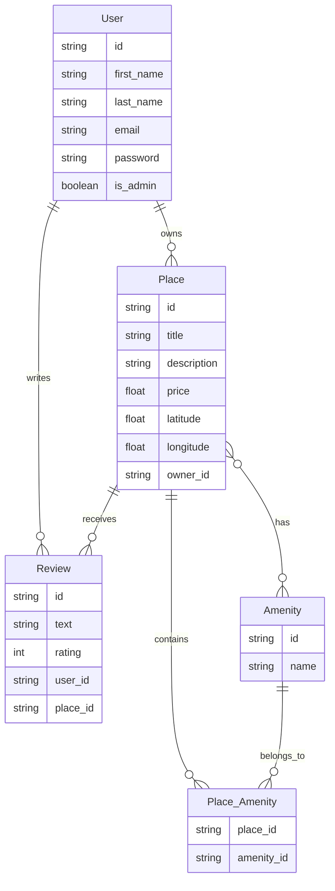

# HBnB Project: Part 3

## Enhanced Backend with Authentication and Database Integration

Welcome to Part 3 of the HBnB Project! In this phase, we extend the backend application by implementing user authentication, authorization, and database integration using SQLAlchemy and SQLite for development, with MySQL configuration for production environments.

## Project Overview

This part of the project focuses on securing the backend, introducing persistent storage, and preparing the application for scalable, real-world deployment.

## Objectives

- **Authentication and Authorization**: Implement JWT-based user authentication using Flask-JWT-Extended and role-based access control with the `is_admin` attribute for specific endpoints.
- **Database Integration**: Replace in-memory storage with SQLite for development using SQLAlchemy as the ORM and prepare for MySQL for production.
- **CRUD Operations with Database Persistence**: Refactor all CRUD operations to interact with a persistent database.
- **Database Design and Visualization**: Design the database schema using Mermaid.js and ensure all relationships between entities are correctly mapped.
- **Data Consistency and Validation**: Ensure that data validation and constraints are properly enforced in the models.

## Learning Objectives

By the end of this part, you will:

- Implement JWT authentication to secure your API and manage user sessions
- Enforce role-based access control to restrict access based on user roles (regular users vs. administrators)
- Replace in-memory repositories with a SQLite-based persistence layer using SQLAlchemy for development and configure MySQL for production
- Design and visualize a relational database schema using Mermaid.js to handle relationships between users, places, reviews, and amenities
- Ensure the backend is secure, scalable, and provides reliable data storage for production environments

## Project Structure

The tasks in this part are organized to build progressively towards a complete, secure, and database-backed backend system:

1. **Modify the User Model to Include Password**: Update the User model to store passwords securely using bcrypt2 and update the user registration logic.
2. **Implement JWT Authentication**: Secure the API using JWT tokens to ensure only authenticated users can access protected endpoints.
3. **Implement Authorization for Specific Endpoints**: Implement role-based access control to restrict certain actions (e.g., admin-only actions).
4. **SQLite Database Integration**: Transition from in-memory data storage to SQLite as the persistent database during development.
5. **Map Entities Using SQLAlchemy**: Map existing entities (User, Place, Review, Amenity) to the database using SQLAlchemy and ensure relationships are well-defined.
6. **Prepare for MySQL in Production**: Configure the application to use MySQL in production and SQLite for development.
7. **Database Design and Visualization**: Use Mermaid.js to create entity-relationship diagrams for your database schema.

## Database Schema

Below is the ER diagram representing our database structure:




## Installation and Setup

1. Clone the repository:
   ```
   git clone https://github.com/ahmedguindou/holbertonschool-hbnb/tree/main
   cd holbertonschool-hbnb
   ```

2. Install dependencies:
   ```
   pip install -r requirements.txt
   ```

3. Run the application:
   ```
   flask run
   ```

## Contributors

Ahmed El Guindou
